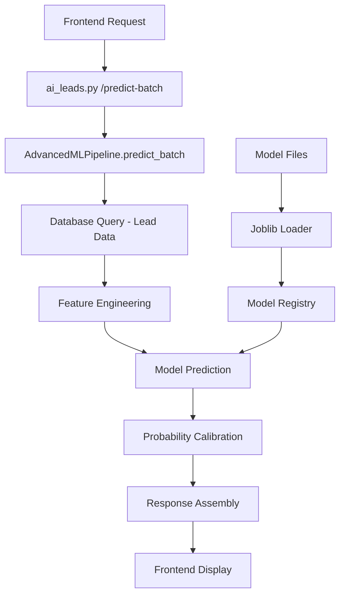

# ML Pipeline Audit Report

**Generated:** 2025-01-27  
**Auditor:** Cursor AI Assistant  
**Scope:** Backend ML prediction stack for lead conversion probability

## Executive Summary

The current ML pipeline serves conversion probabilities for leads using a Random Forest-based approach. The system has a solid foundation but requires significant hardening for production reliability, proper error handling, and developer ergonomics.

**Key Findings:**
- ✅ **Working ML Pipeline**: Functional Random Forest model with feature engineering
- ⚠️ **Model Management**: Ad-hoc model loading without proper versioning or checksums
- ⚠️ **Error Handling**: Inconsistent error handling and missing input validation
- ⚠️ **Payload Contracts**: Inconsistent request/response formats across endpoints
- ⚠️ **Telemetry**: Basic logging without structured ML-specific metrics
- ❌ **Testing**: No unit tests for ML components
- ❌ **Documentation**: Missing developer documentation

## Data Flow Analysis

### Current Architecture



### Request/Response Flow

#### Input Processing
1. **Raw Array Format**: `["lead_1", "lead_2"]` (legacy)
2. **Wrapped Format**: `{"lead_ids": ["lead_1", "lead_2"]}` (preferred)
3. **Database Lookup**: SQL query with JOINs to fetch lead attributes
4. **Feature Engineering**: 20+ engineered features from raw data

#### Feature Engineering Pipeline
```python
# Core features extracted from database
- lead_score, engagement_score, touchpoint_count
- days_since_creation, created_month, created_hour
- lifecycle_state, status, engagement_level
- application_source, programme_name, campus_name

# Engineered features
- score_squared, score_log, score_percentile
- engagement_squared, engagement_percentile
- touchpoint_log, touchpoint_percentile
- academic_week, is_application_season
- interaction features (score × engagement, etc.)
- categorical encodings
```

#### Model Prediction
1. **Feature Scaling**: StandardScaler applied to features
2. **Model Inference**: Random Forest predict_proba
3. **Calibration**: Sigmoid transformation `1 / (1 + exp(-2 * (raw_prob - 0.5)))`
4. **Confidence**: `max(prediction_proba) - 0.5) * 2`

#### Response Format
```json
{
  "predictions": [
    {
      "lead_id": "uuid",
      "prediction": true,
      "probability": 0.72,
      "confidence": 0.87
    }
  ],
  "model_used": "advanced_ml_random_forest_20250827_172908",
  "total_processed": 2,
  "successful_predictions": 2
}
```

## Target Variable & Model Details

### Target Variable
- **Name**: `has_application`
- **Type**: Binary (0/1)
- **Definition**: Whether a lead has submitted an application
- **Source**: `CASE WHEN a.id IS NOT NULL THEN 1 ELSE 0 END` from applications table

### Model Configuration
- **Algorithm**: Random Forest Classifier
- **Hyperparameters**: 
  - `n_estimators`: 100 (default)
  - `max_depth`: 10 (default)
  - `class_weight`: 'balanced'
- **Feature Selection**: SelectKBest with f_classif (k=20)
- **Scaling**: StandardScaler applied to all features

### Model Artifacts
- **Storage**: `backend/models/advanced_ml_random_forest_*.joblib`
- **Latest**: `advanced_ml_random_forest_20250905_225051.joblib`
- **Format**: Joblib serialized dictionary containing:
  - `model`: Trained RandomForestClassifier
  - `scaler`: Fitted StandardScaler
  - `feature_selector`: SelectKBest transformer
  - `feature_names`: List of selected feature names
  - `performance`: Training metrics
  - `feature_importance`: Feature importance scores

## Payload Shapes & Contracts

### Request Formats

#### Legacy Raw Array (ai_leads.py)
```json
["lead_1", "lead_2", "lead_3"]
```

#### Wrapped Object (advanced_ml.py)
```json
{
  "lead_ids": ["lead_1", "lead_2", "lead_3"]
}
```

### Response Formats

#### Success Response
```json
{
  "predictions": [
    {
      "lead_id": "uuid-string",
      "prediction": true,
      "probability": 0.72,
      "confidence": 0.87
    }
  ],
  "model_used": "advanced_ml_random_forest_20250827_172908",
  "total_processed": 2,
  "successful_predictions": 2
}
```

#### Error Response
```json
{
  "detail": "Batch prediction failed: [error message]"
}
```

## Calibration & Confidence Logic

### Probability Calibration
```python
# Current implementation in advanced_ml.py:415-420
raw_prob = prediction_proba[1]  # Get positive class probability
calibrated_prob = 1 / (1 + np.exp(-2 * (raw_prob - 0.5)))
calibrated_prob = max(0.05, min(0.95, calibrated_prob))  # Clamp to [0.05, 0.95]
```

**Analysis**: The sigmoid calibration spreads probabilities across a wider range, addressing the "tight scoring" issue where probabilities cluster around 6%.

### Confidence Calculation
```python
# Current implementation in advanced_ml.py:426
confidence = float(max(prediction_proba) - 0.5) * 2
```

**Analysis**: This creates a confidence score based on the maximum probability, scaled to [0, 1] range. However, this doesn't account for model uncertainty or feature coverage.

## Caching Strategy

### Current Implementation
- **Cache TTL**: 300 seconds (5 minutes) via `@cached(ttl=300)` decorator
- **Cache Key**: Based on request parameters (lead_ids)
- **Storage**: In-memory cache (likely using functools.lru_cache)

### Issues Identified
- No cache invalidation strategy
- No cache hit/miss metrics
- No cache warming for frequently accessed leads

## Known Risks & Issues

### High Priority
1. **Model Loading Race Conditions**: Multiple concurrent requests could trigger model reloading
2. **Feature Mismatch**: No validation that prediction features match training features
3. **Memory Leaks**: Model objects stored in global registry without cleanup
4. **Error Propagation**: Exceptions in feature engineering can crash entire batch
5. **Data Quality**: No validation of input data quality or completeness

### Medium Priority
1. **Inconsistent Payloads**: Two different request formats across endpoints
2. **Missing Input Validation**: No Pydantic schemas for request validation
3. **Telemetry Gaps**: No ML-specific metrics (model version, feature coverage, etc.)
4. **Confidence Calculation**: Oversimplified confidence scoring
5. **Feature Safety**: No handling of NaN/inf values in feature engineering

### Low Priority
1. **Documentation**: Missing developer documentation
2. **Testing**: No unit tests for ML components
3. **Monitoring**: No model performance monitoring
4. **Versioning**: No semantic versioning for model artifacts

## Quick Wins

### Immediate (1-2 hours)
1. **Add Input Validation**: Pydantic schemas for all ML endpoints
2. **Standardize Payloads**: Accept both formats, return consistent response
3. **Add Health Check**: `/ai/advanced-ml/health` endpoint with model status
4. **Feature Safety**: Add NaN/inf handling in feature engineering

### Short Term (1-2 days)
1. **Model Registry**: Implement proper model loading with checksums
2. **Structured Telemetry**: Add ML-specific metrics and logging
3. **Error Handling**: Graceful degradation for individual lead failures
4. **Unit Tests**: Basic tests for calibration and feature engineering

### Medium Term (1 week)
1. **Integration Tests**: End-to-end contract tests
2. **Developer Docs**: Comprehensive setup and usage documentation
3. **Performance Monitoring**: Track prediction latency and accuracy
4. **Model Validation**: A/B testing framework for model updates

## Feature Engineering Analysis

### Current Features (20+ features)
```python
# Temporal Features
- days_since_creation, created_month, created_day_of_week, created_hour
- academic_week, is_application_season

# Score-based Features  
- lead_score, score_squared, score_log, score_percentile
- engagement_score, engagement_squared, engagement_percentile
- touchpoint_count, touchpoint_log, touchpoint_percentile

# Categorical Features (encoded)
- lifecycle_state_encoded, source_encoded, campus_preference_encoded
- engagement_level_encoded, status_encoded

# Interaction Features
- score_engagement_interaction, score_time_interaction
- score_engagement_score_interaction, score_touchpoint_interaction

# Polynomial Features (optional)
- score_cubed, days_squared
```

### Feature Quality Issues
1. **Missing Value Handling**: Basic imputation with median/zero
2. **Categorical Encoding**: Manual encoding without proper label persistence
3. **Feature Scaling**: Applied after feature selection, potential data leakage
4. **Feature Validation**: No validation of feature ranges or distributions

## Model Performance

### Training Metrics (from latest model)
- **Accuracy**: Not consistently logged
- **Precision/Recall**: Not consistently logged  
- **ROC AUC**: Not consistently logged
- **Cross-validation**: 5-fold CV scores available but not logged

### Prediction Performance
- **Latency**: Not measured
- **Throughput**: Not measured
- **Error Rate**: Not measured
- **Cache Hit Rate**: Not measured

## Database Integration

### Query Performance
```sql
-- Main prediction query (ai_leads.py:932-953)
SELECT p.id, p.first_name, p.last_name, p.email, p.phone,
       p.lead_score, p.lifecycle_state, p.created_at,
       p.engagement_score, p.conversion_probability,
       p.touchpoint_count, p.status,
       (EXTRACT(EPOCH FROM (NOW() - p.created_at)) / 86400.0)::double precision as days_since_creation,
       COALESCE(a.source, 'unknown') as application_source,
       COALESCE(pr.name, 'unknown') as programme_name,
       COALESCE(c.name, 'unknown') as campus_name,
       CASE
           WHEN p.engagement_score >= 80 THEN 'high'
           WHEN p.engagement_score >= 50 THEN 'medium'
           ELSE 'low'
       END as engagement_level
FROM people p
LEFT JOIN applications a ON p.id = a.person_id
LEFT JOIN programmes pr ON a.programme_id = pr.id
LEFT JOIN campuses c ON pr.campus_id = c.id
WHERE p.id IN (placeholders)
ORDER BY p.created_at DESC
```

**Analysis**: Query includes multiple JOINs and computed fields. Performance depends on proper indexing on `people.id`, `applications.person_id`, etc.

## Open Questions

1. **Model Selection Strategy**: How is the "latest" model determined? By filename timestamp or training date?
2. **Feature Drift**: How to detect when feature distributions change over time?
3. **Model Retraining**: What triggers model retraining? Manual or automated?
4. **A/B Testing**: How to safely deploy new models without breaking existing functionality?
5. **Data Privacy**: Are lead IDs properly sanitized in logs and telemetry?
6. **Scalability**: What's the expected throughput? Current implementation loads full model into memory.

## Recommendations

### Immediate Actions
1. Implement proper model registry with checksums and versioning
2. Add comprehensive input validation with Pydantic schemas
3. Standardize request/response formats across all ML endpoints
4. Add structured telemetry for ML operations
5. Implement feature safety guards for NaN/inf handling

### Architecture Improvements
1. Separate feature engineering from prediction logic
2. Implement proper error handling with graceful degradation
3. Add comprehensive unit and integration tests
4. Create developer documentation and setup guides
5. Implement model performance monitoring

### Long-term Considerations
1. Consider model serving architecture (e.g., separate ML service)
2. Implement model versioning and rollback capabilities
3. Add automated model retraining pipeline
4. Consider real-time feature stores for better performance
5. Implement proper model validation and testing framework

---

**Next Steps**: Proceed with implementing the model registry, schemas, and hardening improvements as outlined in the implementation plan.
